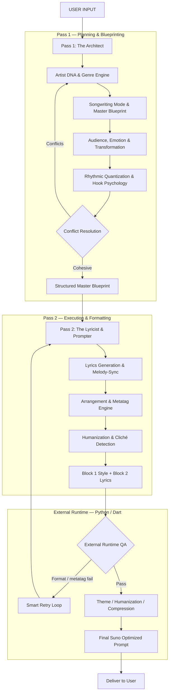

# Music Director — Creation Pipeline Architecture

Canonical order for turning user input into a **Suno-ready** two-block prompt (Udio support is **temporarily disabled**).

**Design goal:** avoid a 17-stage monolith inside one LLM call. Planning runs as **Pass 1**; creative emission as **Pass 2**; format/lyric QA lives in **external runtime** (not model self-scoring).

**Unified orchestrator (prompt law):** [`tools/suno_v4_master_production_architecture.txt`](../tools/suno_v4_master_production_architecture.txt) — V4.5/V5.5 + Platinum five-layer chain. Internal cognition XML (`<master_blueprint>`, `<psychology_audit>`, `<lyric_audit>`) is stripped before delivery.

## Pipeline



### Runtime modes

| Mode | Env | Behavior |
|------|-----|----------|
| **Two-pass** | `PROMPT_PIPELINE=two_pass` (aliases: `architect`, `2pass`) | Pass 1 → JSON blueprint (compact Architect system); Pass 2 → Block 1 + Block 2 with blueprint injected. Format retries **reuse** the cached blueprint (Pass 2 only). |
| **Hybrid draft→polish** | `PROMPT_PIPELINE=hybrid` or LaoZhang lyrics default (`auto`) | Multilingual draft then lyrics polish (not an Architect JSON split). |
| **Single-call** | `PROMPT_PIPELINE=single` | One generation; Pass 1 cognition runs silently inside the monolith if instructed. |

## Stage map

| # | Stage | Pass / layer | Primary source |
|---|--------|--------------|----------------|
| 1 | User input | Intake | App `UserInputModel` / server `GeneratePromptBody` |
| 2–5 | DNA, Genre, Mode, Master Blueprint | Pass 1 | `artist_dna_translation_engine.txt`, genre vault, `human_songwriter_engine_v3.txt`, `music_creation_intelligence_engine.txt` |
| 6–9 | Audience, Emotion, Rhythm, Hook | Pass 1 | `hit_song_psychology_engine.txt`, Music Creation SPB / narrative |
| 10 | **Conflict resolution** | Pass 1 | Genre ↔ Artist DNA ↔ Mode A/B/C must cohere before Pass 2 |
| 11 | Lyrics generation | Pass 2 | Human Songwriter + MELODY-SYNC + BLOCK 2 protocol |
| 12 | **Arrangement & metatags** | Pass 2 | `tools/suno_metatag_syntax.txt` + ARRANGEMENT STAGING FORMAT |
| 13 | Humanization & cliché detection | Pass 2 | Human Authenticity → Nigeria (if applicable) → Genre Humanization → Elite Lyricist |
| 14 | Block 1 & Block 2 emission | Pass 2 | SECTION 0 + Suno signal + mastering blueprints |
| 15 | **Deterministic QA** | External | `suno_output_qa.py`, `suno_format_validation.dart`, `HumanizedLyricsQa` |
| 16 | **Auto revision / retry** | External | Format retry suffix → re-enter Pass 2 (max 2) |
| 17 | Final delivery | App | UI paste-ready Suno Style + Lyrics |

**Removed from in-prompt cognition:** model self-scoring and silent “I revised because…” loops. Those were unreliable in a single generation pass; external QA owns ship/no-ship.

## Runtime layers (outside the LLM)

| Layer | When | Where |
|--------|------|--------|
| **Two-pass orchestrator** | `PROMPT_PIPELINE=two_pass` | `server/app/prompt_pipeline.py` + `architect_pass.py` (Pass 1 JSON → Pass 2 text; retries skip Pass 1) |
| **Draft + polish** | `PROMPT_PIPELINE=hybrid` or LaoZhang auto | `prompt_pipeline.py`, polish system prompt |
| **Deterministic format QA** | Post Pass 2 | `suno_output_qa.py`, `suno_format_validation.dart` |
| **Smart retry** | On QA fail | Inject specific errors into Pass 2 user suffix (max 2) |
| **OpenRouter / LaoZhang post-process** | After format OK | Theme → humanization → Suno compression |
| **User-block injections** | Per request | Matrices, DSE, human realism, genre lyric engines — **strictest constraints last** (recency bias) |
| **Metatag whitelist** | Pass 2 + QA | `tools/suno_metatag_syntax.txt` (section stems); staging blacklist in `staging_and_accent_rules.txt` |

## Precedence (conflicts)

1. **SECTION 0** — caps, Block 2 opt-out, Suno version
2. **Creation pipeline order** (`tools/pipeline_architecture.txt`)
3. **Pass 1 conflict resolution** — Genre / DNA / Mode must agree before lyrics
4. **Artist DNA** — no artist names in output
5. **Platinum v4.0 layers** — Master Director → Psychology → Regional → Elite Lyricist
6. **Micro craft** — Elite Human Lyricist → BLOCK 2 protocol
7. **SECTION 2** output skeleton

## Recency bias (prompt engineering)

LLMs attend strongest to the **end** of the prompt. Absolute hard constraints (Block 1 word/char caps, Block 2 brackets through `[End]`, “output only two blocks — no internal thoughts”) belong in:

1. SECTION 0 (system), and
2. the **tail** of the per-request user block (`user_block_suffix` / retry errors last).

## Advanced songwriter path (optional)

Separate from `/generate-prompt`. Multi-stage lyric engine behind `SONGWRITER_PIPELINE=1`:

| Piece | Where |
|--------|--------|
| API | `POST /generate-lyrics`, `GET /songwriter/status` |
| Orchestrator | `server/app/songwriter/pipeline.py` |
| Model router | `tools/songwriter/model_routing.json` → `router.py` |
| Genre / language packs | `tools/songwriter/genres/*.json`, `languages/*.json` |
| Deterministic lint | `server/app/songwriter/linting.py` (forbidden, structure, script) |
| Genre masters (stages 5–7) | `genre_lyrics_user_block` via `songwriter/genre_engines.py` (truncated) |
| Sources → deploy | `python tools/merge_songwriter_prompts.py` (also via `merge_all.py`) |
| Flutter | Advanced songwriter toggle + output/quality modes on Generate |

Output modes include full song, chorus/verse/bridge only, hook ideas, concepts, titles, rewrite/improve/humanize/translate, and variations. Quality modes: `fast` \| `balanced` \| `premium` \| `debug`.

See [`docs/SONGWRITER_LLM_ARCHITECTURE.md`](SONGWRITER_LLM_ARCHITECTURE.md).

## Rebuild after editing sources

```bash
python tools/merge_all.py
```

See [`tools/README.md`](../tools/README.md) for the file-level merge list.
