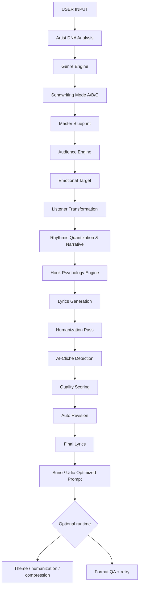

# Music Director — Creation Pipeline Architecture

Canonical internal order for turning user input into a Suno/Udio-ready two-block prompt. Stages 2–17 run **inside the model** (merged system prompt). Optional **app/server** post-processing runs after generation.

**Unified orchestrator:** [`tools/suno_v4_master_production_architecture.txt`](../tools/suno_v4_master_production_architecture.txt) — V4.5/V5.5 architect + Platinum five-layer chain; three internal audits stripped before user delivery.

## Pipeline



## Stage map (prompt sources)

| # | Stage | Primary source |
|---|--------|----------------|
| 1 | User input | App `UserInputModel` / server `GeneratePromptBody` → user message block |
| 2 | Artist DNA analysis | `tools/artist_dna_translation_engine.txt` |
| 3 | Genre engine | Vault snapshot, SECTION 1A–1F, genre templates |
| 4 | Songwriting mode | `tools/human_songwriter_engine_v3.txt` §3 (Mode A/B/C) |
| 5 | Master blueprint | Platinum Layer 1 · `tools/music_creation_intelligence_engine.txt` §6 |
| 6 | Audience | Platinum Layer 2 · `tools/hit_song_psychology_engine.txt` §2 |
| 7 | Emotional target | Music Creation `transformation_arc` + Human Songwriter §2 |
| 8 | Listener transformation | Music Creation §6 + Hit Song Psychology §1 |
| 9 | Rhythmic quantization & narrative | Music Creation §2 SPB · §3 · `rhythmic_quantization` |
| 10 | Hook psychology | Hit Song `<psychology_audit>` + Music Creation §4 |
| 11 | Lyrics generation | Human Songwriter `<lyric_audit>` + SECTION 2 + MELODY-SYNC + BLOCK 2 protocol |
| 12 | Humanization pass | Platinum Layer 3 · `tools/human_authenticity_engine.txt` → `tools/nigeria_cultural_realism_engine.txt` (when Nigerian context) → `tools/genre_specific_humanization_engine.txt` |
| 13 | AI-cliché detection | Platinum Layer 4.1 · `tools/elite_human_lyricist_directive.txt` + BLOCK 2 §1 |
| 14 | Quality scoring | Human Songwriter §6–§7 + Music Creation §6–§7 |
| 15 | Auto revision | Internal audits + format retry |
| 16 | Final lyrics | Locked Block 2 performable lines |
| 17 | Suno/Udio prompt | SECTION 0 Block 1 + signal principles + mastering blueprints |

**Internal cognition blocks** (`<master_blueprint>`, `<psychology_audit>`, `<lyric_audit>`) are stripped before the user sees output — see `suno_internal_output_strip`.

## Runtime layers (outside the monolithic prompt)

| Layer | When | Where |
|--------|------|--------|
| **Draft + polish** | `PROMPT_PIPELINE=hybrid` (OpenRouter; off by default on LaoZhang) | `server/app/prompt_pipeline.py`, `suno_polish_system_prompt.dart` |
| **OpenRouter post-process** | Theme → humanization → compression | `server/app/openrouter_post_process.py` |
| **Format QA + retry** | Incomplete Block 1/2 | `suno_output_qa.py`, `suno_format_validation.dart` |
| **User-block injections** | Per request | Drum/live instrument/code matrices, human realism, authenticity |

## Precedence (conflicts)

1. **SECTION 0** — caps, Block 2 opt-out, Suno version
2. **Creation pipeline order** (`tools/pipeline_architecture.txt`)
3. **Artist DNA** — no artist names in output
4. **Platinum v4.0 layers** — Master Director → Psychology → Regional → Elite Lyricist (+ Human Songwriter macro)
5. **Micro craft** — Elite Human Lyricist → BLOCK 2 protocol
6. **SECTION 2** output skeleton

## Rebuild after editing sources

```bash
python tools/merge_all.py
```

See [`tools/README.md`](../tools/README.md) for the file-level merge list.
